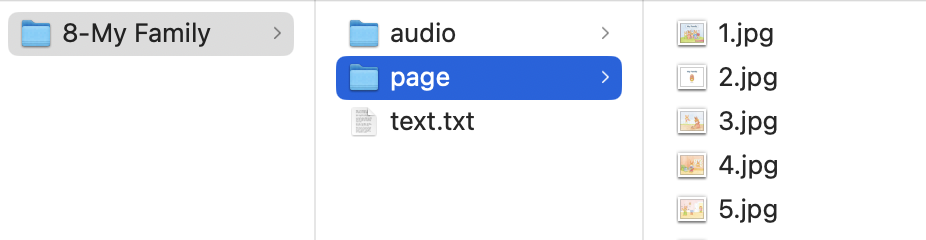

# 绘创工坊

用于自制绘本。

如果有自己的绘本图片，可以使用此软件进行播放。

## 制作绘本

一个绘本创建一个文件夹，命名为绘本名称。绘本内容示例如下：


- `page`文件夹，其中以数字命名每页图片，此为必须。
- `audio`文件夹，如果有每页对应的音频，可以创建此文件夹，并以数字命名每个页面对应的音频文件。
- `text.txt`文件，如果有每页对应的字幕，可以创建此文件，并在其中输入每页对应的字幕。内容格式为`页码#字幕`。如下：
```
1#第一页字幕内容
3#第三页字幕内容
```

将制作好的绘本放到设备中。

## 添加绘本
打开软件后，点击左上角的`编辑`图标，可点击右下角出现的`+`图标选择绘本所在的目录。再点击右上角的`✓`以保存（`×`以取消编辑）。软件主页将展示绘本书架，点击对应的绘本可进行播放，或点击书架中的文件夹进入下一级（此时可通过左上角的回退箭头返回上级目录）。

## 绘本播放
默认为手动播放模式，可左右翻页进行播放，翻页后会播放对应页面的音频。软件顶部中央有一个向下的箭头，点击弹出播放控制菜单，`返回`用于退出播放，`字幕`用于控制字幕开关，`播放模式`用于切换当前播放模式，点击后依次切换5种模式。

- 手动播放：手动左右翻页。
- 单个播放：自动播放当前绘本。
- 单个循环：自动播放当前绘本，结束后再次从头播放。
- 列表播放：自动播放当前绘本所在目录下所有的绘画，每个绘本播放结束后，自动播放下一个绘本，直到播完全部绘本。
- 列表循环：自动播放当前绘本所在目录下所有的绘画，每个绘本播放结束后，自动播放下一个绘本，并不断播放目录下所有的绘本。
